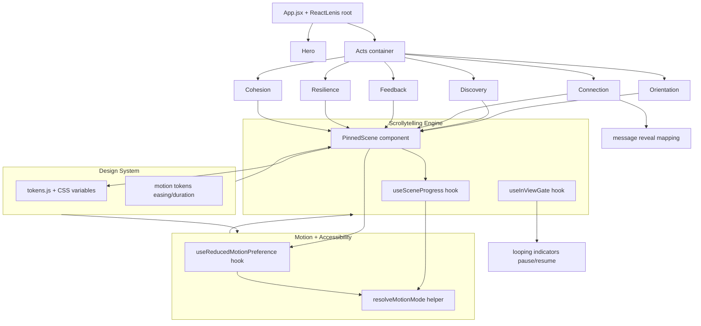

# Design Document

## Overview

This design elevates the Movie Explorer Showcase into a scroll-driven, "scrollytelling"
landing page while keeping the existing narrative structure (Hero + six acts: Orientation,
Discovery, Connection, Feedback, Resilience, Cohesion). The work stays within the current
stack — React 19, Vite, Framer Motion v12, Lenis smooth scroll, Tailwind CSS v3, and
lucide-react — and introduces four reusable building blocks:

1. A **centralized Design-Token module** (`src/design/`) that owns colors, gradients,
   typography scale, spacing scale, and motion tokens (easing curves + durations). Tokens are
   defined once and surfaced both as CSS custom properties (for Tailwind/class usage) and as a
   JS object (for Framer Motion props). (Requirement 2, Requirement 7.6)
2. A **Scrollytelling Engine** built around a `PinnedScene` component and a `useSceneProgress`
   hook. Each act renders inside a tall pin container with a `sticky` inner panel; Framer
   Motion's `useScroll` produces a normalized `scrollYProgress` (0→1) that scrubs the act's
   animation. (Requirement 1, Requirement 7)
3. A **Reduced-Motion strategy** centered on a `useReducedMotionPreference` hook that wraps
   Framer Motion's `useReducedMotion` plus a live `matchMedia` listener, and a pure
   `resolveMotionMode` helper so every animated component degrades to its final static state.
   (Requirement 5, Requirement 1.6, Requirement 7.7)
4. A **Performance strategy** that restricts scroll-driven and continuous motion to
   `transform`/`opacity`, gates continuous animations behind viewport visibility, and applies
   `will-change` only while a scene is active. (Requirement 6)

The disliked fake-cursor chat in `AutoDemoChat.jsx` is replaced by a `ConnectionScene` whose
messages are revealed one-at-a-time as a pure function of scroll progress, with looping
presence/typing indicators that are independent of scroll. (Requirement 4)

### Design Decisions and Rationale

- **Framer Motion `useScroll`/`useTransform` over GSAP ScrollTrigger.** The Connection act
  already demonstrates the `h-[300vh]` + `sticky top-0 h-screen` pin pattern with
  `useScroll({ target, offset })`. Standardizing on this avoids adding a new ~50KB dependency
  and a second animation runtime, keeps a single mental model, and integrates cleanly with
  Lenis (which only needs Framer's `ScrollTimeline`-style scroll position, not GSAP). GSAP is
  not justified for this scope. (Requirement 1.4)
- **CSS-variable tokens + JS mirror.** Tailwind v3 already consumes HSL CSS variables
  (`index.css`). Extending that system (rather than replacing it) preserves existing classes,
  enables instant light/dark theme switching by swapping variables, and gives Framer Motion a
  typed JS object for easing/duration props. (Requirement 2.2, 2.4)
- **Pure mapping functions for progress→state.** All "what should be visible at progress p"
  decisions (message reveal count, scene phase, motion mode) are pure functions. This isolates
  testable logic from React/DOM and is the basis of the Correctness Properties below.

## Architecture



### Scroll and Pin Model

Each pinned act follows the proven pattern already present in `Connection.jsx`:

```
<div ref={containerRef} className="relative h-[Npx or Nvh]">      // pin track (scroll distance)
  <div className="sticky top-0 h-screen overflow-hidden ...">     // pinned viewport panel
     <SceneContent progress={scrollYProgress} />                  // scrubbed by progress
  </div>
</div>
```

- The **pin track** height defines the scroll distance over which the act stays pinned. With
  `sticky top-0`, the inner panel stays glued to the viewport top from the moment the track's
  top reaches the viewport top until the track's bottom passes — satisfying "hold fixed until
  Scroll_Progress reaches 1" and "release and resume normal scrolling at 1" without manual
  scroll hijacking. (Requirement 1.1, 1.3)
- `useScroll({ target: containerRef, offset: ["start start", "end end"] })` yields
  `scrollYProgress`, a MotionValue normalized 0→1 linearly across the track. All sub-animations
  derive from it via `useTransform`, so playback is progress-driven, never time-driven.
  (Requirement 1.4, 1.2)
- The inner panel is `h-screen` with `overflow-hidden`, so content never clips past the top or
  bottom edge while pinned; oversized content is laid out within the `h-screen` panel using
  internal fl/grid centering. (Requirement 1.5)

### Reduced-Motion Branch

`PinnedScene` reads `useReducedMotionPreference()`. When reduced motion is active, the pin
track collapses to natural height (no `h-[Nvh]`, no `sticky`), and `SceneContent` renders at
its final state (equivalent to `progress = 1`) under normal document flow. The same flag stops
all looping indicators and replaces them with a single static frame. (Requirement 1.6,
Requirement 5.1, 5.2, 5.3, 5.6, Requirement 7.7)

## Components and Interfaces

### 1. Design Token Module — `src/design/tokens.js` + `src/index.css`

CSS custom properties remain the source of truth for color so Tailwind keeps working; the JS
module mirrors non-color tokens (typography scale, spacing scale, motion) and re-exports color
token *names* for programmatic use.

```js
// src/design/tokens.js
export const motion = {
  easing: {
    standard: [0.4, 0, 0.2, 1],   // cubic-bezier — general UI
    entrance: [0.16, 1, 0.3, 1],  // expo-out — reveals
    emphasized: [0.22, 1, 0.36, 1],
  },
  duration: {                      // ms — all within [200, 1200] (Req 7.6)
    fast: 200,
    base: 400,
    slow: 700,
    scene: 1200,
  },
};

export const typeScale = {         // >= 5 steps (Req 2.1)
  xs: { size: '0.75rem',  line: '1rem',    weight: 500 },
  sm: { size: '0.875rem', line: '1.25rem', weight: 500 },
  base:{ size: '1rem',    line: '1.5rem',  weight: 400 },
  lg: { size: '1.25rem',  line: '1.75rem', weight: 600 },
  xl: { size: '2rem',     line: '2.25rem', weight: 700 },
  '2xl': { size: '3rem',  line: '1.1',     weight: 800 },
};

export const space = ['0.25rem','0.5rem','1rem','2rem','4rem','8rem']; // >= 5 steps (Req 2.1)

export const gradients = {         // >= 2 gradients (Req 2.1)
  brand:   'linear-gradient(135deg, hsl(var(--grad-from)), hsl(var(--grad-via)), hsl(var(--grad-to)))',
  surface: 'radial-gradient(circle at 30% 20%, hsl(var(--grad-glow) / 0.12), transparent 60%)',
};

export const colorRoles = [        // named roles (Req 2.1)
  'background','surface','primary','secondary','accent',
  'bodyText','headingText','border',
];
```

```css
/* src/index.css — every role defined for BOTH themes (Req 2.3) */
:root {
  --background: 0 0% 100%;
  --surface: 210 16% 97%;
  --primary: 243 75% 59%;
  --secondary: 280 65% 60%;
  --accent: 330 81% 60%;
  --body-text: 222 30% 25%;     /* >= 4.5:1 on background (Req 2.5) */
  --heading-text: 222 47% 11%;  /* >= 3.0:1 for >=24px (Req 2.5) */
  --border: 210 16% 85%;
  --grad-from: 243 75% 59%; --grad-via: 280 65% 60%; --grad-to: 330 81% 60%;
  --grad-glow: 243 75% 59%;
}
.dark {
  --background: 222 47% 7%;
  --surface: 222 47% 10%;
  --primary: 243 75% 70%;
  --secondary: 280 65% 72%;
  --accent: 330 81% 68%;
  --body-text: 215 20% 82%;
  --heading-text: 210 20% 98%;
  --border: 217 34% 17%;
  --grad-from: 243 75% 65%; --grad-via: 280 65% 66%; --grad-to: 330 81% 66%;
  --grad-glow: 243 75% 65%;
}
```

Tailwind `theme.extend.colors` maps these roles (`background`, `surface`, `primary`, …) so all
components use `bg-background`, `text-body-text`, `from-primary`, etc., with zero hard-coded hex
or gradient literals. (Requirement 2.2, 2.6) Theme switching swaps the `.dark` class on
`<html>`; CSS variable re-resolution is synchronous (well under 100 ms). (Requirement 2.4)

### 2. `PinnedScene` — `src/components/scrolly/PinnedScene.jsx`

A reusable wrapper that encapsulates the pin track + sticky panel + reduced-motion branch.

```jsx
/**
 * @param {number} pinVh        total scroll distance as vh (e.g. 300 => h-[300vh]); track height
 * @param {(p: MotionValue<number>) => ReactNode} children  render-prop receiving scene progress
 * @param {string} id
 * @param {string} panelClassName
 */
function PinnedScene({ id, pinVh = 300, panelClassName, children }) { ... }
```

Behavior:
- Normal mode: renders `relative h-[{pinVh}vh]` track + `sticky top-0 h-screen overflow-hidden`
  panel; calls `children(scrollYProgress)`.
- Reduced motion: renders a single natural-height section; calls `children(staticProgress=1)`
  where `staticProgress` is a constant MotionValue locked at 1 so child `useTransform`
  expressions resolve to their final values without any scrubbing. (Requirement 1.6, 5.2)

### 3. `useSceneProgress` — `src/components/scrolly/useSceneProgress.js`

Wraps `useScroll` and exposes the normalized progress plus helpers:

```js
function useSceneProgress(containerRef, { reducedMotion }) {
  const { scrollYProgress } = useScroll({ target: containerRef, offset: ['start start','end end'] });
  const progress = reducedMotion ? useConstantMotionValue(1) : scrollYProgress;
  return { progress };
}
```

It also exposes the **pure** `normalizeProgress(scrollTop, trackTop, trackHeight, viewportH)`
used in tests, which clamps to `[0,1]` and maps linearly. (Requirement 1.1, 1.4)

### 4. `useReducedMotionPreference` — `src/hooks/useReducedMotionPreference.js`

```js
function useReducedMotionPreference() {
  const fmReduced = useReducedMotion();            // Framer's initial read
  const [reduced, setReduced] = useState(fmReduced);
  useEffect(() => {
    const mq = window.matchMedia('(prefers-reduced-motion: reduce)');
    const onChange = (e) => setReduced(e.matches); // live updates (Req 5.4, 5.5)
    mq.addEventListener('change', onChange);
    setReduced(mq.matches);
    return () => mq.removeEventListener('change', onChange);
  }, []);
  return reduced;
}
```

Paired with a pure helper:

```js
// resolveMotionMode(reduced) -> 'static' | 'animated'
// resolveSceneState(progress, reduced) -> reduced ? FINAL : phaseFor(progress)
```

React state updates from the `change` event flush well within the 500 ms budget.
(Requirement 5.4, 5.5)

### 5. `useInViewGate` — `src/hooks/useInViewGate.js`

Wraps Framer's `useInView` (IntersectionObserver) to drive continuous (looping) animations.
Returns `inView` and a `shouldLoop` flag. Looping indicators set `animate` only while
`shouldLoop` is true and freeze on a static frame otherwise — pausing within one observer
callback (<100 ms). It also exposes a 30%-threshold variant (`amount: 0.3`) for triggering act
motion sequences. (Requirement 6.4, Requirement 7.2, 7.3)

### 6. `ConnectionScene` — `src/components/acts/Connection.jsx` (rewrite) + `src/components/ui/ConnectionChat.jsx`

Replaces `AutoDemoChat.jsx`. No cursor element exists at any progress. (Requirement 4.1)

- A fixed, ordered `CHAT_TIMELINE` array of messages, each with a `revealAt` progress
  threshold. A pure `revealedCount(progress, timeline)` returns how many messages are visible.
  Increasing progress reveals the next message; decreasing progress hides the most recent.
  (Requirement 4.2)
- Each message animates in with `opacity` + `translateY`/`scale` only (transform/opacity), no
  layout-affecting properties. (Requirement 4.3)
- A persistent **presence status** ("Online") and a **typing indicator** that appears just
  before the next *incoming* message's reveal threshold. (Requirement 4.4)
- Typing dots and delivery ticks loop continuously via `animate`/`transition: { repeat:
  Infinity, duration: 1.4 }` — a fixed 1.4 s cycle independent of scroll progress, gated by
  `useInViewGate`. (Requirement 4.5)
- At `progress = 1`, `revealedCount` equals the full timeline length and no reveal/typing/
  delivery *transition* is mid-flight (looping indicators may continue). (Requirement 4.6)

`AutoDemoChat.jsx` is deleted; `Connection.jsx` consumes `PinnedScene` and passes `progress`
into `ConnectionChat`.

### 7. Act Integration

Each act becomes a `PinnedScene` child mapping its progress to a short motion sequence using
`useTransform` with token easing/durations:

| Act | Narrative question | Pinned motion (transform/opacity only) |
|-----|--------------------|-----------------------------------------|
| Orientation | Where am I? | Title + UI chrome assemble; parallax layers translate as progress advances |
| Discovery | What can I do? | Featured backdrop scales/fades; detail panel + cast pills stagger in |
| Connection | Who am I interacting with? | `ConnectionChat` message reveal timeline |
| Feedback | Did my action succeed? | Action → success state morph (scale/opacity), toast slides in |
| Resilience | What about errors? | Error → recovery sequence; retry affordance fades through |
| Cohesion | Why consistent? | Brand gradient unifies; CTA to live app resolves |

Act order is fixed in `App.jsx` and never reordered or omitted. (Requirement 7.1) The Cohesion
CTA links to the live Movie Explorer app and appears once ≥30% of the act is visible.
(Requirement 7.4)

## Data Models

```ts
// Motion tokens
type Easing = [number, number, number, number];      // cubic-bezier control points
interface MotionTokens {
  easing: { standard: Easing; entrance: Easing; emphasized: Easing };
  duration: { fast: 200; base: 400; slow: 700; scene: 1200 }; // ms, all within [200,1200]
}

// Typography step
interface TypeStep { size: string; line: string; weight: number; }

// Color token resolution
type ColorRole =
  | 'background' | 'surface' | 'primary' | 'secondary'
  | 'accent' | 'bodyText' | 'headingText' | 'border';
type Theme = 'light' | 'dark';
type TokenTable = Record<Theme, Record<ColorRole, string>>; // every role defined per theme

// Scrollytelling scene
interface SceneConfig {
  id: string;
  pinVh: number;            // pin-track scroll distance
}
type Progress = number;     // normalized 0..1

// Connection chat
type Sender = 'me' | 'them';
interface ChatMessage {
  id: number;
  sender: Sender;
  text: string;
  revealAt: number;         // progress threshold in [0,1], strictly increasing by id order
  showTypingBefore?: boolean;
}
type ChatTimeline = ChatMessage[]; // fixed order, sorted ascending by revealAt

// Motion mode
type MotionMode = 'animated' | 'static';
interface SceneState {
  mode: MotionMode;
  revealedCount: number;    // for chat scenes
  phase: number;            // discrete phase index derived from progress
}
```

Key pure functions (the testable core):

```ts
normalizeProgress(scrollTop: number, trackTop: number, trackHeight: number, viewportH: number): Progress
revealedCount(progress: Progress, timeline: ChatTimeline): number
resolveSceneState(progress: Progress, timeline: ChatTimeline, reduced: boolean): SceneState
shouldLoop(visibilityRatio: number, reduced: boolean): boolean
contrastRatio(fgHsl: string, bgHsl: string): number   // WCAG relative-luminance ratio
```

## Correctness Properties

*A property is a characteristic or behavior that should hold true across all valid executions
of a system — essentially, a formal statement about what the system should do. Properties serve
as the bridge between human-readable specifications and machine-verifiable correctness
guarantees.*

The scrollytelling engine is intentionally factored so the decision logic (what should be
visible at a given scroll progress, how breakpoints partition widths, when loops are gated, how
reduced motion overrides everything) lives in **pure functions**. Those functions are the
property-tested core. Layout, CSS sticky behavior, frame timing, and rendered visuals are
covered by example/integration tests instead (see Testing Strategy), because they are not
input-varying logic.

### Property 1: Progress normalization is total, clamped, and monotonic

*For any* `scrollTop`, `trackTop`, `trackHeight > 0`, and `viewportH`, the result of
`normalizeProgress(scrollTop, trackTop, trackHeight, viewportH)` is always within `[0, 1]`, and
for any two scroll positions `s1 <= s2` the progress is non-decreasing
(`normalizeProgress(s1, …) <= normalizeProgress(s2, …)`), so forward scrolling advances toward 1
and backward scrolling reverses toward 0.

**Validates: Requirements 1.1, 1.2**

### Property 2: Chat message reveal is monotonic and fully revealed at progress 1

*For any* fixed-order `ChatTimeline` and any two progress values `p1 <= p2` in `[0, 1]`,
`revealedCount(p1, timeline) <= revealedCount(p2, timeline)` and the result is always within
`[0, timeline.length]` (increasing progress reveals the next message, decreasing progress hides
the most recently revealed message and never an earlier one). Additionally,
`revealedCount(1, timeline) === timeline.length` (all messages are revealed at progress 1).

**Validates: Requirements 4.2, 4.6**

### Property 3: Reduced motion forces final static state everywhere

*For any* progress value in `[0, 1]`, any `ChatTimeline`, and any visibility ratio, when reduced
motion is active (`reduced = true`): `resolveSceneState(progress, timeline, true)` equals the
final scene state (its `mode` is `'static'` and its `revealedCount` equals `timeline.length`),
and `shouldLoop(visibilityRatio, true) === false` — i.e. no scroll-scrubbed or looping animation
is ever active regardless of scroll position or visibility.

**Validates: Requirements 1.6, 5.1, 5.2, 5.6, 7.7**

### Property 4: Off-screen scenes do not loop

*For any* `reduced` flag, when a scene is fully off-screen (`visibilityRatio === 0`),
`shouldLoop(visibilityRatio, reduced) === false`; and the gate is threshold-monotonic — once
`shouldLoop` is false at a given visibility it is not true at any strictly lower visibility.

**Validates: Requirements 6.4**

### Property 5: Breakpoint selection partitions every viewport width

*For any* viewport width in `[320, 3840]`, `pickBreakpoint(width)` returns exactly one breakpoint
whose defined width range contains that width (mobile `[320,767]`, tablet `[768,1023]`, desktop
`[1024,3840]`); the ranges are mutually exclusive and jointly exhaustive over the domain, so no
width maps to zero or more than one breakpoint.

**Validates: Requirements 3.7**

### Property 6: At most one act is the active motion scene

*For any* set of per-act visibility ratios, the active-act selector returns at most one active
act, and it never selects an act whose visibility is below the 30% threshold when another act
meets it — so no two acts' motion sequences are designated active simultaneously.

**Validates: Requirements 7.3**

### Property 7: Motion duration tokens stay within the allowed bound

*For any* duration value defined in the Design_System motion tokens, the value is within
`[200, 1200]` milliseconds, so every act motion sequence that draws its duration from the tokens
animates within the required range.

**Validates: Requirements 7.6**

## Error Handling

- **Cohesion CTA target unavailable (Requirement 7.5).** The CTA is a normal anchor to the live
  app; the act content renders independently of CTA reachability. A lightweight reachability
  check (e.g. an `onError`/timeout guard around any preview probe, capped at 5 s) flips the CTA
  into an "unavailable" state — the link is disabled/labeled accordingly while **all
  already-rendered Cohesion content is retained**. No exception propagates to the rest of the
  page.
- **TMDB data missing/slow (Discovery, Hero).** Existing TanStack Query loading/error states are
  preserved; motion sequences consume already-available data only and fall back to static
  placeholder content when data is absent, so animation never blocks on the network.
- **`matchMedia` unsupported / SSR-less guards.** `useReducedMotionPreference` guards
  `window.matchMedia` existence and defaults to "animation enabled" only when the API is
  available; otherwise it falls back to Framer's `useReducedMotion()` initial read.
- **Performance degradation (Requirement 6.6, 6.7).** If a continuous animation is detected
  driving frame rate below 55 fps for >500 ms while visible, the loop handler stops/simplifies
  the animation and **leaves the element on its final frame** (no snap-back), preserving the
  act's final visual state.
- **Oversized pinned content (Requirement 1.5).** The `h-screen overflow-hidden` panel clips
  internally rather than overflowing the document; content is centered within the panel so
  nothing escapes the top/bottom edges while pinned.
- **Horizontal overflow (Requirement 3.4).** Container max-widths, `overflow-x` guards on the
  root, and transform-based (not layout-based) motion prevent animations from pushing content
  past the viewport width.

## Testing Strategy

This feature mixes pure decision logic (property-tested) with UI/layout/performance behavior
(example- and integration-tested). Both layers are required for confidence.

### Tooling

- **Test runner:** Vitest (Vite-native; no separate config burden) with `jsdom` environment.
- **Component testing:** React Testing Library for render/interaction assertions.
- **Property-based testing:** `fast-check` (the standard PBT library for the JS/TS ecosystem).
  Property-based tests are **not** implemented from scratch.

If Vitest/RTL/fast-check are not yet present, they are added as dev dependencies as part of
implementation.

### Property-Based Tests (pure logic core)

Each correctness property maps to a **single** `fast-check` property test running a **minimum of
100 iterations**. Each test is tagged with a comment referencing its design property:

```
// Feature: showcase-motion-enhancement, Property 1: Progress normalization is total, clamped, and monotonic
```

| Property | Function under test | Generators |
|----------|--------------------|------------|
| P1 | `normalizeProgress` | random `scrollTop`, `trackTop`, `trackHeight>0`, `viewportH` |
| P2 | `revealedCount` | random sorted `ChatTimeline`, ordered progress pairs `p1<=p2` in [0,1] |
| P3 | `resolveSceneState`, `shouldLoop` | random progress, timeline, visibility ratio; `reduced=true` |
| P4 | `shouldLoop` | random visibility ratios incl. 0; both `reduced` values |
| P5 | `pickBreakpoint` | random width in [320,3840] |
| P6 | active-act selector | random arrays of visibility ratios |
| P7 | motion duration tokens | enumerate token table values |

### Example / Unit Tests

Focused, concrete cases that are not input-varying:

- Token module exposes all color roles, ≥2 gradients, ≥5 type steps, ≥5 spacing steps (Req 2.1).
- Every color role resolves to a non-empty value in light and dark themes (Req 2.3).
- `contrastRatio` for body/background ≥ 4.5:1 and heading/background ≥ 3.0:1 in each theme
  (Req 2.5); `contrastRatio` sanity (symmetry, result in [1,21]) as a supporting unit check.
- Headings draw size/line/weight from `typeScale` (Req 2.6).
- `ConnectionChat` renders no cursor element at progress 0, 0.5, 1 (Req 4.1).
- Animated style keys across motion components are a subset of `{opacity, x, y, scale, rotate,
  transform}` — no `width/height/top/left/margin` (Req 4.3, 6.1, 6.5).
- Typing/delivery loop cycle duration is within [1s, 2s] and not bound to progress (Req 4.5).
- Reduced mode renders all narrative text and CTAs visible (no opacity-0 gating) (Req 5.3).
- Acts render in fixed DOM order Orientation→Cohesion (Req 7.1).
- Cohesion CTA appears and links to the live app URL when ≥30% visible (Req 7.4); CTA-timeout
  fallback shows an unavailable indicator and retains content (Req 7.5).
- `useReducedMotionPreference` flips to static on a `matchMedia` `change` to "reduce" and back to
  animated on change away (Req 5.4, 5.5 — logic portion).

### Integration / Visual / Performance Tests

Behaviors that depend on layout, the browser, or device timing — verified with 1–3
representative examples or manual benchmarking, **not** property tests:

- Sticky pin holds and releases correctly; resumes normal scroll at progress 1 (Req 1.3).
- Pinned `h-screen` panel clips nothing past top/bottom edges (Req 1.5).
- Responsive layouts at mobile/tablet/desktop widths; no horizontal overflow across sampled
  widths in [320,3840] (`scrollWidth <= clientWidth`) (Req 3.1–3.5).
- Touch (no-hover) devices keep CTAs operable (Req 3.6).
- Theme swap re-resolves colors within 100 ms (Req 2.4).
- Scroll-update frame budget ≤16.67 ms and ≥55 fps for 95% of frames on a mid-range device
  (Req 6.2, 6.3) — measured via browser performance profiling.
- Off-screen pause within 100 ms and degradation-stop preserving final frame (Req 6.4 timing,
  6.6, 6.7) — observed via instrumented runtime checks.
- Act motion triggers within 200 ms of reaching 30% visibility (Req 7.2).

### Configuration Notes

- Property tests: `fc.assert(fc.property(...), { numRuns: 100 })` minimum.
- Each property test carries the `Feature: showcase-motion-enhancement, Property N: …` tag
  comment linking it back to this document.
